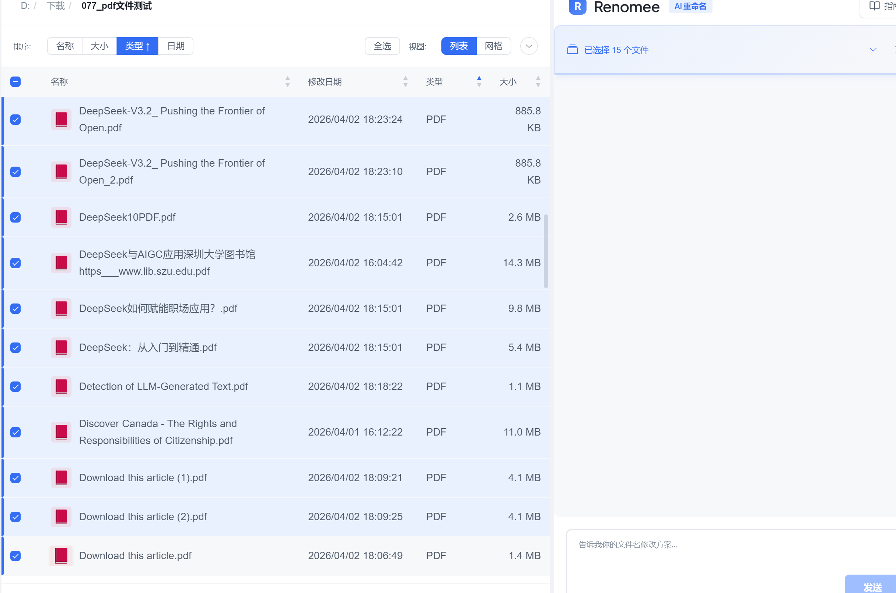

# 如何做某事

> **快速导航**：[问题场景](#问题) → [解决方案](#解决方案) → [步骤指南](#步骤) → [相关教程](#相关)

---

## 问题背景 {#问题}

描述用户的具体痛点：

- ❌ **当前困境**：用户通常怎么做？为什么麻烦？
- ⏱️ **时间成本**：手动处理需要多久？
- 😫 **具体痛点**：举 1-2 个真实场景的例子

**示例场景**：
> 王教授有 500+ 篇下载的研究论文，文件名都是 `paper_12345.pdf`，每次找论文都要逐个打开查看...

---

## Renomee 的解决方案 {#解决方案}

Renomee AI 如何解决这个问题：

- ✅ **智能识别**：自动读取文件内容
- ✅ **一键批量**：处理数百个文件只需几分钟
- ✅ **零学习成本**：用自然语言描述规则即可

!!! success "效果对比"
    **之前**：`IMG_20240315_143022.jpg`  
    **之后**：`Paris_Eiffel_Tower_2024-03-15.jpg`

---

## 操作步骤 {#步骤}

### 步骤 1：安装 Renomee

如果还没有安装，请先 [下载 Renomee AI](https://renomeeai.com/download)。

支持 Windows 10+ 和 macOS 10.15+。

---

### 步骤 2：选择文件夹

1. 启动 Renomee
2. 点击 **"选择文件夹"** 或拖拽文件夹到窗口
3. Renomee 会自动扫描文件



---

### 步骤 3：输入重命名规则

在规则输入框中，用自然语言描述你的需求：

```plaintext
根据文件内容重命名 PDF 文件
```

或者更具体的：

```plaintext
将 PDF 文件重命名为：标题_作者_年份.pdf
```

!!! tip "规则技巧"
    - 简单描述即可，无需正则表达式
    - 支持中文和英文
    - 可以引用文件的元数据（日期、作者等）

---

### 步骤 4：预览和执行

1. 点击 **"预览"** 查看重命名效果
2. 检查是否符合预期
3. 确认无误后，点击 **"执行"**


✅ **完成！** 几秒钟内完成数百个文件的智能重命名。

---

## 高级技巧 {#技巧}

### 技巧 1：处理特殊字符
如果文件名包含特殊字符，Renomee 会自动替换为安全字符。

### 技巧 2：批量撤销
担心改错？Renomee 支持一键撤销最近的操作。

### 技巧 3：保存常用规则
常用规则可以保存为模板，下次直接调用。

---

## 常见问题 {#FAQ}

??? question "支持哪些文件格式？"
    Renomee 支持几乎所有常见格式：PDF、Word、Excel、图片、音频、视频等。
    
    详见：[支持的文件格式](../guide/supported-formats.md)

??? question "会修改文件内容吗？"
    不会。Renomee 只修改文件名，绝不改动文件内容。

??? question "大文件需要很久吗？"
    Renomee 优化了大文件处理，50MB 的 PDF 也能在几秒内完成。

---

## 相关教程 {#相关}

继续学习 Renomee 的其他功能：

- 📄 [重命名 PDF 文件的完整指南](../file-types/pdf/)
- 📸 [批量整理照片](../file-types/images/)
- 🎓 [学术论文管理方案](../use-cases/research/)
- ⚡ [高级功能总览](../guide/advanced-features.md)

---

## 立即开始

**还没有安装 Renomee？**

👉 [免费下载 Renomee AI](https://renomeeai.com/download)  
👉 [查看更多使用场景](../use-cases/)

---

*有问题？访问 [常见问题](../faq.md) 或联系我们。*
